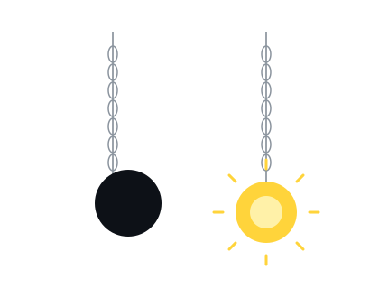

<div align="center">

# Hi, I'm Rufet Gasimov.


<br>

`C#` &nbsp; • &nbsp; `.NET` &nbsp; • &nbsp; `SQL Server` &nbsp; • &nbsp; `EF Core`

</div>

<br>

<table>
<tr>

<td width="52%" valign="middle">

## `> whoami`

```yaml
name: Rufet Gasimov

education:
  AI Programming @ Code Academy

role:
  C# / .NET Developer

focus:
  Backend Development

currently_learning:
  - C#
  - .NET
  - SQL Server
  - Entity Framework Core
  - Python
  - Artificial Intelligence

status:
  Learning. Building. Improving.
```

</td>

<td width="48%" align="center" valign="middle">
  

</td>

</tr>
</table>

---

<div align="center">

## `> technologies`

<br>


<br><br>


</div>

---

## `> cat learning.txt`

```text
C# / .NET
│
├── Object-Oriented Programming
├── LINQ
├── Async / Await
├── Dependency Injection
├── Reflection
└── JSON & File Operations


DATABASE
│
├── SQL Server
├── ADO.NET
├── Entity Framework Core
├── CRUD Operations
├── Migrations
├── JOIN
├── GROUP BY
└── Relationships


SOFTWARE DEVELOPMENT
│
├── SOLID Principles
├── Repository Pattern
├── Service Layer
├── Dependency Injection
└── Git & GitHub


TESTING
│
├── Unit Testing
└── Moq


AI PROGRAMMING
│
├── Python
├── Programming Fundamentals
└── Artificial Intelligence
```

---

<div align="center">

## `> ./projects`

</div>

<table>

<tr>

<td width="50%" valign="top">

### 🚗 Rent A Car

`C#` `EF Core` `SQL Server`

Simple database-driven car rental application.

```text
+ Add Cars
+ List Cars
+ SQL Database
+ CRUD Operations
+ Rental Management
```

</td>

<td width="50%" valign="top">

### 🎓 Student Management

`C#` `EF Core` `SQL Server`

Student and group management application.

```text
+ CRUD
+ One-to-Many
+ Entity States
+ Relationships
```

</td>

</tr>

<tr>

<td width="50%" valign="top">

### 🍽️ Menu Management

`C#` `.NET` `Moq`

Backend service architecture practice.

```text
+ Repository Pattern
+ Service Layer
+ AutoMapper
+ Unit Testing
+ Memory Cache
```

</td>

<td width="50%" valign="top">

### 📦 Order Processing

`C#` `.NET` `JSON`

Advanced C# concepts practice.

```text
+ Async Programming
+ Dependency Injection
+ Reflection
+ Deep Copy
+ JSON Serialization
```

</td>

</tr>

</table>

---

<div align="center">

## `> github --stats`

<br>


</div>

---

<div align="center">

## `> contribution --activity`


</div>

---

<div align="center">

## `> system.status`

```text
[ OK ] C#                   █████████░
[ OK ] SQL Server           ████████░░
[ OK ] Entity Framework     ███████░░░
[ .. ] Backend Development  ███████░░░
[ .. ] Python               █████░░░░░
[ .. ] Artificial Intelligence
```

<br>


<br><br>


<br>

### `while (alive) { learn(); build(); improve(); }`

</div>
