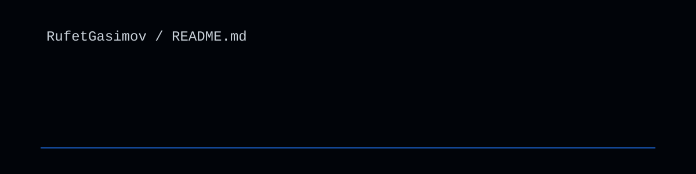

  

 

  

 

  <pre>
◆ Class   --> Backend Developer
◆ Origin  --> Azerbaijan AZ
◆ Edu     --> Code Academy
◆ Skills  --> C# / .NET / Python / SQL
  </pre>

  

<h2 align="center">Statistics</h2>

  

  

 

  

  

<h2 align="center">Contributions</h2>

  

  

<h2 align="center">Technologies</h2>

  

  

  

